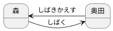

# 罰ゲームルーレット

## 使用言語
TypeScript

## 機能
### メイン処理
* 罰ゲームの追加
* 罰ゲームの削除
* 罰ゲーム一覧の表示
* ルーレットを回す

#### 罰ゲームの追加
* 追加する項目を入力する
* 追加ボタンを押下することにより、罰ゲーム一覧に追加される
* 入力内容を罰ゲーム一覧のテキストファイルに追加する ←検討中
    * 各項目は改行にて一行ごとに記載される

#### 罰ゲームの削除
* 罰ゲーム一覧の中から削除したい罰ゲームを選択し、削除ボタンを押下する
* 罰ゲーム一覧のテキストファイルを読み込む ←検討中
    * ファイル内の文章を一行ごとに読み出し、リストに格納する
* テキストファイルの一覧から選択項目を削除する ←検討中
    * 選択された要素をリスト内から削除し、更新する
    * 更新されたリストでテキストファイルの内容を上書きする

#### 罰ゲーム一覧の表示
* 次ここから！

#### ルーレットを回す
* ルーレットを「回す」ボタンを押下することで、結果表示領域に一覧にある罰ゲームが順番に表示される。
* ルーレットを「止める」ボタンを押下することで、結果表示領域の連続表示が止まり、結果が表示される
* 選択された罰ゲームを実施済み罰ゲーム一覧に格納する
    * 選ばれた内容を実施済み罰ゲームのリストに書き込む
    * 罰ゲームリストから今回選ばれた罰ゲームを削除し、罰ゲーム一覧のテキストファイルを更新する

## 画面イメージ
罰ゲームルーレットの画面イメージは以下の通り

## 機能追加検討項目
* 筋トレルーレットの追加
* 罰ゲームポイントの管理機能追加
* ルーレットが回転するようなUI
* ポイントのたまった人のルーレットボタンのみ押下可能にする

